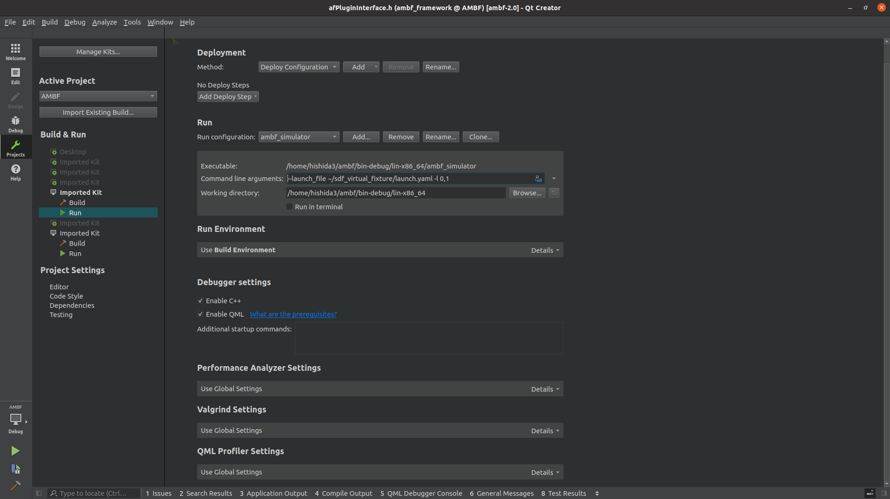

# How to Debug AMBF and AMBF Plugin
Qtcreator is a great IDE for C and C++ development and we will use it for setting up a debugger for AMBF. You can use the debugger both for AMBF or any of its plugins.

## Compile AMBF in debug mode
Go into your AMBF repo and create a new folder "build-debug".

Do NOT use Qtcreator debug mode before doing the following steps.

```bash
cd <ambf path>
mkdir build-debug
cd build-debug
cmake .. -DCMAKE_BUILD_TYPE=Debug
make 
```

Note that you can also have another `build` folder with 'Release' mode build type. This should not impact our debug build configuration.

## Run AMBF in Debug mode
Open Qtcreator and load the AMBF project using the CMakeLists.txt file in the main AMBF folder. Qtcreator would automatically find the build folder and the associated configuration. Go ahead and click "Configure Project" as shown in this image.

Now we can set the 'ambf_simulator' as the executable in the bottom left configuration. Please also make sure that the Debug configuration is selected. This is important if you had another build folder in AMBF compiled in Release mode.

Next, to the Projects is the left pane of Qtcreator, and set the `Executable` and `Command Line arguments`. Now we are reading to run AMBF in debug mode and even set breakpoints in code.


## Compile plugin in Debug mode
After compiling AMBF in the debug mode, specify the "AMBF_DIR" to point to the "build-debug" folder that you created in the previous step.
After you change "AMBF_DIR", you can configure by "c" and generate by  pressing "g".

```
cd <plugin path>
cd build
ccmake . # Change the "AMBF_DIR" to "<ambf path>/build-debug"
cmake .. -DCMAKE_BUILD_TYPE=Debug
make
```

## QtCreator
Please make sure that you have finished the previous steps before going to this step.

Open the projects, AMBF and your plugin, and build them in "DEBUG" mode.
Select AMBF project as "active project" and specify your run configuratioin in "Project" tab on your left.



## Trouble shooting
In the case when you have a trouble compiling, you can try following steps and redo the steps.

```
rm CMakeLists.txt.user #If using QtCreator
rm CMakeCache.txt
```
