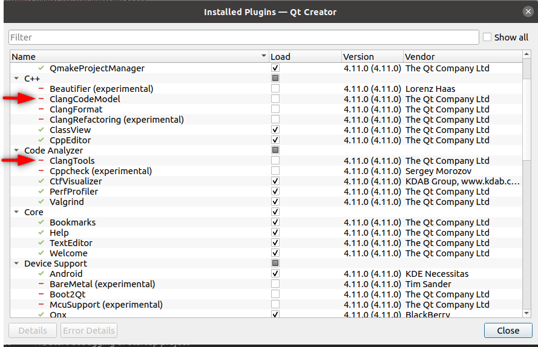
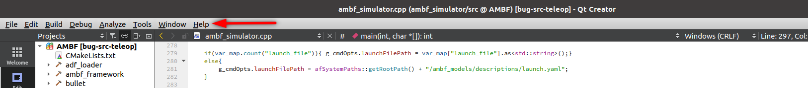
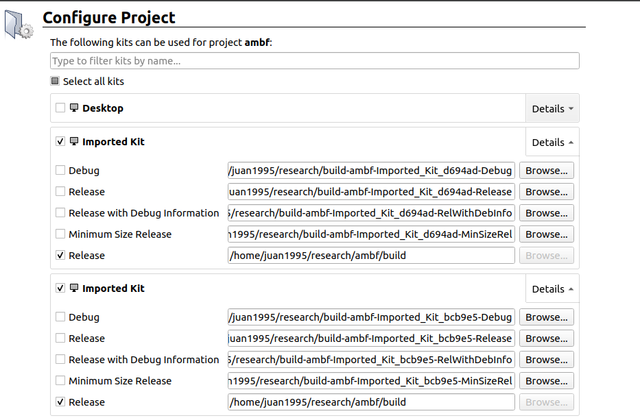
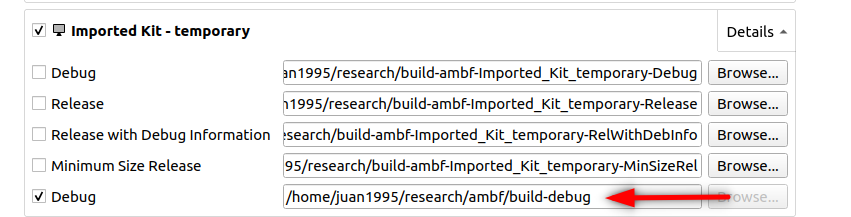
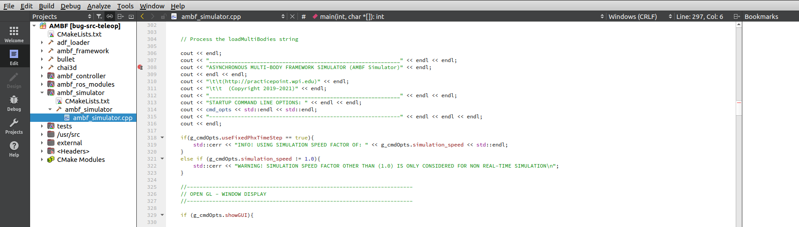
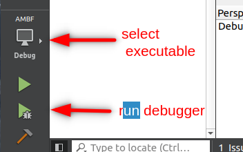
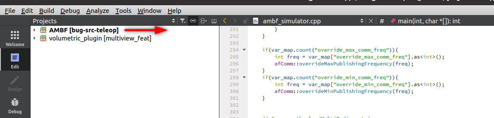
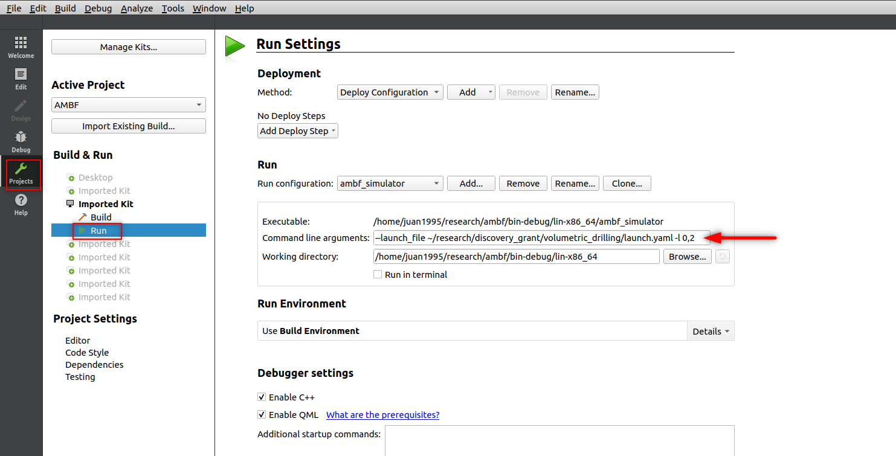

Qtcreator is a great IDE for C and C++ development and we will use it for setting up a debugger for AMBF. You can use the debugger for both AMBF and any of its plugins. The instructions below were tested on Ubuntu 20.04 and Qt Creator `4.11.0`


## Qt Creator first-time setup

<details>
<summary>Click to expand</summary>

<br>

When installing Qt Creator for the first time you will need to disable the plugins `ClangCodeModel` and the `ClangTools` to avoid getting linting errors when seeing AMBF source code.




Plugin configuration can be found in the `Help` -> `about plugins`



</details>

## Debugging AMBF source code

### Step 0

For any CMake project loaded in Qt Creator, Qt Creator will store the configuration in an `XML` file called `CMakeLists.txt.user`. If you find this file in the AMBF root (`ambf`) folder, please make sure to erase this file before continuing the steps below.

### Step 1

Compile AMBF in debug mode. Ensure you are not sourcing any previously compiled versions of ROS into your terminal session (Check your `.bashrc`).

```
cd <ambf path>
mkdir build-debug
cd build-debug
cmake .. -DCMAKE_BUILD_TYPE=Debug
make 
```

Note that you can also have another build folder with a 'Release' mode build for AMBF. Executables for the debug and release builds are kept separate. 

### Step 2

Open Qt creator in a new terminal session and source ROS and the ambf-debug build from step one.

```
source  <ambf path>/build-debug/devel/setup.bash
qtcreator
```

Now, import AMBF into Qt Creator using the `CMakeLists.txt` file in the root folder of AMBF. Make sure you get the configure project window in Qt Creator. If you don't see the configure project window please see [troubleshooting section](#troubleshooting).



From the configure window select only the kit that contains the `Debug` configuration and uncheck the `Release` kit if it is displayed.



### Step 3

Select a breakpoint and start the debugger.



Then, finally, select the correct executable and run the debugger



# Debugging AMBF plugin

Before debugging an AMBF plugin, make sure that you can run the [debugger in ambf](#debugging-ambf-source-code).

### Step 1 - Build your plugin in debug mode

Compile your plugin in debug mode. Remember to source the correct AMBF build. Before compiling also make sure that the CMAKE option `AMBF_DIR` points to the build-debug. After you change the "AMBF_DIR" option in `ccmake`, you can configure with "c" and generate by pressing "g".

```
cd <plugin path>
cd build
ccmake . # Change the "AMBF_DIR" to "<ambf path>/build-debug"
cmake .. -DCMAKE_BUILD_TYPE=Debug
make
```

### Step 2 - Add project in Qt Creator

Add plugin code to Qt Creator and re-select the AMBF project as the active project. You can do this by right-clicking on the ambf project.



### Step 3 - Config CMD arguments and run the debugger

Config command line arguments. Remember to use absolute paths.



Then, select a breakpoint in your plugin and run the debugger.

## Troubleshooting

In case of any problem, the best option is to erase the `CMakeLists.txt.user` that stores the QtCreator configuration for a project and the `CMakeCache.txt` (stored in your build and build-debug folder) and start the debugging steps again.

